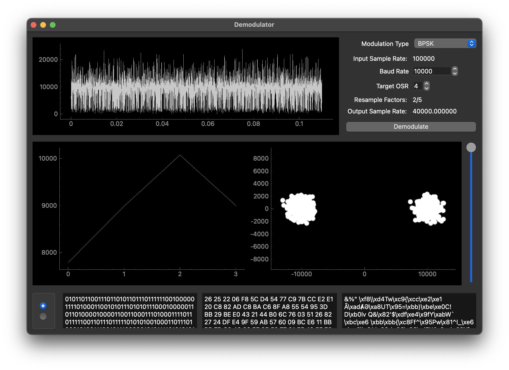

# ReImage 


ReImage is a Python 3 + PySide6 + PyQtGraph app for quickly visualizing recorded RF data in the form of real and imaginary (IQ) samples. Think of it as Adobe Audition or Audacity, but for raw complex samples.

The goals for this project are to provide quick, offline ways of examining recorded data. As such, it is not meant to do everything DSP-related. It is aimed to be used after performing test recordings to verify that the recordings will be useful for further processing later on.

In particular, ReImage attempts to maximise smoothness (frames-per-second) of plots via explicit downsampled versions of the data, for a better user experience. This alleviates the 'laggy plot' issue often encountered when using Matplotlib to visualise raw signal data with over about 1 million points, and when using PyQtGraph with over about 10-100M points. In a world where signal bandwidths are reaching over 100MHz, this is becoming more and more common.

After the initial loading, scrolling in and out of plots of up to 500M samples or more is still buttery-smooth (at least for me!).

There are two main use-cases for ReImage:

1. Plotting large number of samples from files.
2. (Experimental) Exporting/importing of data to/from Python/MATLAB. This lets you use ReImage like a plotting library with a smoother user experience for large arrays.

## Installation and Usage (From Source)

To run it from source, it is advisable to create a new virtual environment first; many of the PySide vs PyQt libraries do not play well with each other, so this is highly advised.

Clone this repository with

```bash
git clone https://github.com/icyveins7/reimage.git
```

and then - while in the new virtual environment - install the required libraries with

```bash
pip install -r requirements.txt
```

Note that the requirements file is based on a Python 3.11 install, and may not work exactly if the Python version is different (and especially if it is too old).

If you are using a different Python version and the above doesn't work, you may try

```bash
pip install numpy scipy Pillow pyqtgraph PySide6 sounddevice
```

To run the app,

```bash
python main.py
```

## Usage (From Binaries)

The pre-built binaries in the Releases section are created using [PyInstaller](https://github.com/pyinstaller/pyinstaller). Simply download the tar.gz relevant to your OS and unzip where desired. Then run the 'main' executable. These were built using the batch scripts in the repository (so if these pre-built versions don't work, you can try to rebuild a binary for your OS by yourself).

Alternatively, you may want to look for the latest CI/CD automatic builds in [Actions](https://github.com/icyveins7/reimage/actions) by downloading the artifacts in one of the latest passing workflows.

## Quick-start


Most users should find that the tooltips at the bottom-left and bottom-right of the windows suffice as guidance.

1. Populate the file list via 'Open File(s)' or 'Open Folder'. You can now also drag and drop files into the list from your file explorer.
2. Select some files in the file list (via Ctrl-Click or Shift-Click). Clear the entire list with the 'Clear' button or specific files via the Delete key. Search for particular files by typing something into the search bar.
4. Click 'Add to Viewer' to open the files and configure some settings. You can also press Enter after selecting the files, or double-click a single file.
5. View the Amplitude-Time (top) and Spectrogram (bottom) plots. 
6. Scroll in/out using mouse wheel. Use Left-Click to drag the plots, and hold Right-Click to stretch/zoom the plots along a particular axis.
7. Use Ctrl-RightClick on the plots to see additional options.

## DSP Functionality

### Initial Settings


### Taking Slices of Samples

This is done with Ctrl-Alt-Click. Most further functionality will use the user's slice if this action was performed. Otherwise, the entire array of samples will be used.


### Simple Spectrum (FFT)


### Baud Rate Estimation


This performs a baud rate estimation via a simple cyclostationary method:

$$
x[n] \rightarrow \mathcal{F} [|x[n]|]
$$

For PSK modulations, this results in peaks in the resulting spectrum at the baud rate.

### Frequency Offset Estimation


This performs a frequency offset estimation via a simple cyclostationary method:

$$
x[n] \rightarrow \mathcal{F}[x[n]^m]
$$

This works for m-PSK modulations, where the largest peak is found at $mf$ where $f$ is the frequency offset of the signal. A zoomed FFT using CZTs can be used to find the true peak at subsample bins.

### Demodulation



This is currently only implemented for PSK modulations. The signal should be frequency-corrected by adjustments when loading the file. Then the demodulator will

1. Resample the signal based on the user's parameters.
2. Find the eye-opening.
3. Demodulate.
4. View the constellation plot and demodulated symbol indices.

You can also select the plotted constellation points by highlighting the text in the first outputbox; this helps you remove the 'noise' symbols from the plot.

### Audio Manipulation (FM Signals or Wav Files)

Using this on a .wav file will load and play the real samples as audio.

Using this on a file with any other extension will treat the complex samples as an FM signal, and perform a simple demodulation via

$$
a[n] = \text{angle}(x[n] x^*[n+1])
$$

The new window will contain a simple audio player that should arbitrarily play, pause, stop (rewind to the start) and drag the playline around. You can also adjust the frequency of the audio to correct the pitch in realtime.

### Exporting/Importing to Python/MATLAB

You can exported the selected samples for further processing to Python or MATLAB with ```Select Data for Export```. Then, in Python you can do:

```python
# This requires you to have the ipc.py file in your path
from ipc import getReimageData
data = getReimageData()
```

or for MATLAB:

```MATLAB
% Add the matlab/ folder to path to find these functions
data = getReimageData();
```


The reverse is also possible; you can send data for plotting to ReImage from Python:

```python
# This requires you to have the ipc.py file in your path
from ipc import sendReimageData
sendReimageData(data) # Some numpy array
```

or from MATLAB:

```MATLAB
% Add the matlab/ folder to path to find these functions
sendReimageData(data);
```

The transfers are done over the loopback IP address with port 5000 by default, so no disk space is used in either direction.


## Issues

This is a personal project and is a constant work-in-progress. As such, there are likely to be many bugs; I will try to attend to any issues posted ASAP but don't count on it being fixed expeditiously. However, if you have ideas on what functionalities you'd like to see, I'd be happy to consider them.

